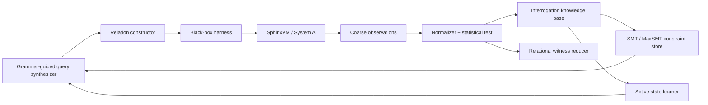

# Sphinx Interrogator

> Ask relational questions; synthesize the riddle's answer.

**Sphinx Interrogator** is a formal-methods playground for recovering hidden state from a deliberately leaky microcoded virtual machine. It combines relational oracles, interrogation testing, active automata learning, SMT solving, and counterexample-guided query synthesis.

This repository is intentionally a **synthetic research sandbox**. System A, **SphinxVM**, is a custom cycle-accurate microcoded machine with a configurable hidden secret and a subtle scheduler/replay fault. System B, **Interrogator**, may only use the public black-box protocol. It learns secret constraints by generating related programs, checking expected relations between their observations, and synthesizing the next experiment that best separates the remaining hypotheses.

## Repository metadata

- **Suggested GitHub repository name:** `sphinx-interrogator`
- **Suggested description:** `A formal-methods playground for recovering hidden state from a deliberately leaky microcoded VM using relational oracles, interrogation testing, active automata learning, and CEGIS.`
- **Suggested topics:** `program-analysis`, `program-synthesis`, `formal-methods`, `metamorphic-testing`, `active-automata-learning`, `side-channel`, `cegis`, `smt`, `rust`, `python`
- **License:** Apache-2.0

## What makes the project interesting

The target does not expose the secret through an architectural instruction. Every accepted probe program has secret-independent public output. The only signal is a coarse, noisy observation produced by a faulty microarchitectural scheduler. A single run is usually uninformative. Information appears through **relations among several runs**:

- two programs are proven architecturally equivalent;
- a fault-free leakage contract predicts equal or ordered normalized observations;
- the implementation violates that relation only for some hidden configurations;
- the violation is compiled into a logical constraint over the secret and hidden microstate;
- a synthesizer chooses the next related program family to split the surviving hypotheses.

The project therefore treats secret recovery as a combined problem in relational verification, active experimental design, automata learning, and syntax-guided synthesis—not as a conventional brute-force timing attack.

## System overview



SphinxVM is implemented in Rust and speaks JSON Lines over standard input/output. Interrogator is implemented in Python and is prohibited from importing the VM crate, reading its challenge file, or inspecting its process memory. The protocol boundary is part of the experiment.

## Primary research questions

1. Can an interrogation-testing knowledge base outperform ordinary stateless metamorphic testing when the observable behavior is both relational and history-dependent?
2. Can a SyGuS-like probe grammar plus CEGIS reliably synthesize experiments that maximize expected candidate-set reduction?
3. How should active automata learning and secret inference interact when observations depend on persistent hidden microstate?
4. How weak can the injected fault be while still supporting robust recovery under realistic query and noise budgets?
5. Can relational witness reduction preserve both the architectural proof obligation and the secret constraint induced by a violation?

## Intended difficulty profiles

| Profile | Hidden target | Observation | Reset model | Goal |
|---|---:|---|---|---|
| `tutorial` | 16 secret bits | exact cycles | hard reset | deterministic end-to-end teaching path |
| `standard` | 32 secret bits | quantized cycles + bounded jitter | hard reset | main benchmark and ablation target |
| `research` | 32 secret bits + hidden lane permutation/state | quantized stochastic samples | soft/hard reset | stateful learning and robust inference |
| `fault-free` | same as standard | same channel, defect disabled | hard reset | negative control; recovery must fail |

The numerical budgets in `docs/EVALUATION.md` are project acceptance targets, not claims about an already completed implementation.

## Start here

1. Read [`docs/PROJECT_BRIEF.md`](docs/PROJECT_BRIEF.md) for the design in one document.
2. Read [`docs/FORMAL_MODEL.md`](docs/FORMAL_MODEL.md) and [`docs/RELATION_ORACLES.md`](docs/RELATION_ORACLES.md) for the mathematical core.
3. Read [`docs/DSL_AND_ARCHITECTURE.md`](docs/DSL_AND_ARCHITECTURE.md) for the exact language and machine semantics.
4. Read [`docs/PROTOCOL.md`](docs/PROTOCOL.md) for the versioned black-box boundary.
5. Read [`agent/CODEX_TASK_SPEC.md`](agent/CODEX_TASK_SPEC.md) for the complete implementation contract.
6. Give [`agent/CODEX_MASTER_PROMPT.md`](agent/CODEX_MASTER_PROMPT.md) to Codex from the repository root.
7. The coding agent must follow [`AGENTS.md`](AGENTS.md) and maintain [`agent/plans/0001-full-system.md`](agent/plans/0001-full-system.md).
8. Use [`docs/GITHUB_SETUP.md`](docs/GITHUB_SETUP.md) for repository metadata, labels, milestones, and first issues.
9. See [`VALIDATION.md`](VALIDATION.md) for the current verification record and explicit limitations.

## Planned commands

```bash
just bootstrap          # install/check local toolchains
just fmt                # Rust + Python formatting
just lint               # clippy + ruff + static checks
just test               # all unit/property/integration tests
just verify-formal      # TLC and SMT contract checks when available
just demo-tutorial      # recover a seeded 16-bit challenge
just benchmark-standard # reproducible standard-profile campaign suite
```

The scaffold deliberately keeps several implementation functions unfinished. The exact expected behavior, milestones, and acceptance tests are specified under `agent/`.

## Scope and safety

This project studies a deliberately constructed VM. It must not grow adapters for real processors, cryptographic libraries, production services, or third-party targets. See [`ETHICS.md`](ETHICS.md), [`SECURITY.md`](SECURITY.md), and [`docs/THREAT_MODEL.md`](docs/THREAT_MODEL.md).
